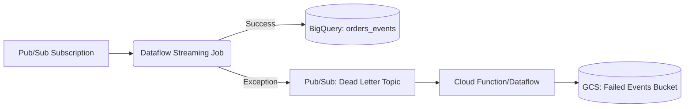
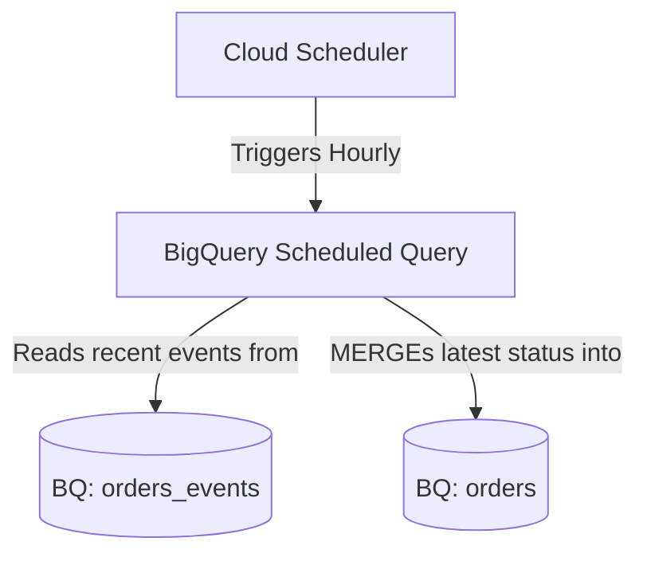
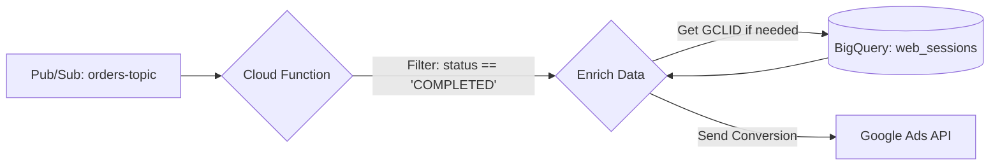

# Data Engineering Assignment: Solution

This document provides the complete solution and architectural answers for the RCA Data Engineer assignment.

---

## Part 1: Stream Data

### The Streaming Pipeline
The core of the streaming pipeline is a Python script located at `stream_data/data_streamer.py`. It's a straightforward piece of code that connects to the `orders-sub` Pub/Sub subscription, performs a basic transformation on the incoming JSON message, and streams the result directly into BigQuery.

The destination table is defined in `stream_data/schema.sql`. It is partitioned by the `ingestion_time` to keep queries on recent data fast and cost-effective. Clustering by `order_id` will also significantly speed up the aggregation work we need to do later.

### Ideal Architecture & Error Handling
In my opinion, a production system on RCA would definetly use a **Dataflow** streaming job. It's built for this exact purpose and handles autoscaling and errors easily.

My proposed architecture would look like this:



---

## Part 2: Aggregated Tables

This section covers two solutions for creating an `orders` table with only the latest status, updated hourly.

### Solution Overview

1.  **BigQuery Scheduled Query (Proposed):** This is a simple, serverless, and cost-effective solution perfect for the hourly requirement. It uses a `MERGE` statement scheduled directly within BigQuery.
2.  **Cloud Composer (Airflow) + dbt:** A more robust, scalable solution for complex data ecosystems. Airflow would orchestrate the job, and dbt would manage the SQL transformation logic, testing, and documentation. -
_(I will not be sharing a solution for this one since I am not familiar enough with those tools. My answer came from a simple Google Search and I could use some more time to further learn about this topic)_

### Orchestration Diagram (Solution 1: Scheduled Query)

This diagram shows the simple flow for the serverless BigQuery-native solution.



### SQL Transformation Code (`aggregate_tables/transform_orders.sql`)

This `MERGE` statement finds the latest event for each order within a recent time window and upserts it into the destination `orders` table.

```sql
MERGE `rca-assessment.rca_dataset.orders` T
USING (
    SELECT 
        order_id,
        status,
        amount,
        created_at,
        event_timestamp as last_updated_at
    FROM `rca-assessment.rca_dataset.orders_events`
    WHERE ingestion_time >= TIMESTAMP_SUB(CURRENT_TIMESTAMP(), INTERVAL 1 HOUR)
    QUALIFY ROW_NUMBER() OVER(PARTITION BY order_id ORDER BY event_timestamp DESC) = 1
) S
ON T.order_id = S.order_id
WHEN MATCHED THEN
  UPDATE SET 
      status = S.status, 
      last_updated_at = S.last_updated_at,
      amount = S.amount
WHEN NOT MATCHED THEN
  INSERT (order_id, status, amount, created_at, last_updated_at)
  VALUES (order_id, status, amount, created_at, last_updated_at)
```

---

## Part 3: Conversion Upload

### Architecture Diagram (Google Ads Upload)

The upload should be triggered as soon as the event occurs. A Cloud Function is a perfect serverless tool for this task.



### Additional Data Requirements

To successfully attribute an offline conversion, one piece of data is essential:

*   **`gclid` (Google Click ID):** This ID is appended to the URL when a user clicks an ad.

If the `gclid` is not present in the initial `orders-topic` message, the Cloud Function would need to **enrich** the event by looking it up in another table, such as:
*   `web_sessions`: A table mapping a `session_id` or `user_id` to a `gclid`.

### Required Google Ads API Fields

To upload an offline click conversion using the Google Ads API, the following fields are needed for the `ClickConversion` object:

1.  **`gclid`**: The Google Click ID captured from the user's click.
2.  **`conversion_action`**: The resource name of the specific conversion action you've configured in your Google Ads account.
3.  **`conversion_date_time`**: The timestamp of when the conversion occurred (the `event_timestamp` of the "COMPLETED" status).
4.  **`conversion_value`**:The value of the conversion (the `amount` from the order).
5.  **`currency_code`**: The currency of the `conversion_value`.