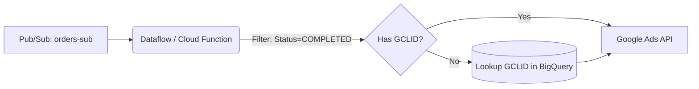

```mermaid
graph LR
    A[Pub/Sub: orders-sub] --> B(Dataflow / Cloud Function)
    B -->|Filter: Status=COMPLETED| C{Has GCLID?}
    C -->|Yes| D[Google Ads API]
    C -->|No| E[(Lookup GCLID in BigQuery)]
    E --> D

```