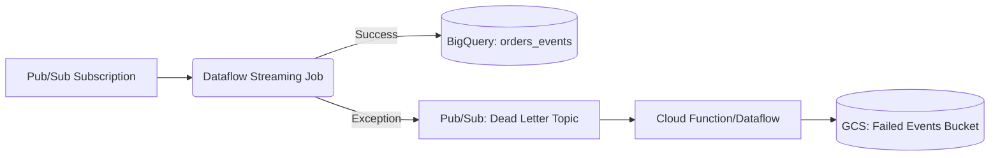

# System Architecture

```mermaid
graph LR
    A[Pub/Sub Subscription] --> B(Dataflow Streaming Job)
    B -->|Success| C[(BigQuery: orders_events)]
    B -->|Exception| D[Pub/Sub: Dead Letter Topic]
    D --> E[Cloud Function/Dataflow]
    E --> F[(GCS: Failed Events Bucket)]

```